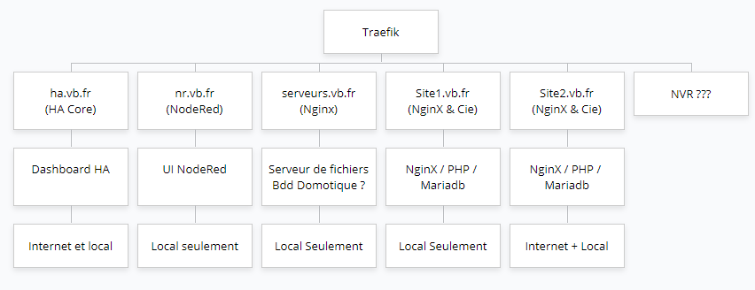

# Serveur Sécurisé Multi-Objectifs

Reflexions projet pour mon serveur en utilisant traefik

# Objectifs

1. Supporter ma domotique
2. Sauvegarder (mariadb) des données des capteurs domotiques)
3. Supporter un serveur Web NginX pour le stockage de fichiers accessibles pour les services installés sur le serveur (ex: bibliothèques de tts en mp3 pour l'alarme)
4. Supporter des serveurs de dev de sites web (Un docker-compose avec NginX, Mariadb et Php par site web)
5. Stocker ma base de donnée de mot de passes bitwarden
6. Pouvoir accéder à des services depuis l'extérieur en toute sécurité (reverse proxy)
7. Intégrer la vidéo surveillance des caméras de la maison (rec, detection....)
8. Pourquoi pas, selon les besoins matériels, difficulté, etc : Montage d'un VPN pour accéder à du stockage (idée à avoir en tête mais pas la plus importante, loin de là)

# Organisation actuelle

Le serveur est sur une base Linux Debian et *tout est installé en containers docker* (avec docker-compose) géré par UI via Portainer.
J'ai un nom de domaine enregitré avec dynDNS possible pour renvoyer vers les différents services.
J'ai des soucis de permissions sur Linux pour une raison que je n'ai pas encore approfondi.

Rien n'est "en prod", certaines choses sont plus embêtantes si je ne les aient plus mais rien n'est indispensable.

### Organisation de ma domotique

J'utilise principalement Zigbee2mqtt et NodeRed. HA me sert uniquement de DashBoard

Liste des containers :
- NodeRed
- Zigbee2mqtt
- Home Assistant
- Mosquitto
- Mqtt-explorer (stack mqtt-explorer)

Ce qui est fait actuellement :
- [X] Capteurs Zigbee appairés avec Zigbee2mqtt
- [X] Zigbee2mqtt publie vers Mosquitto
- [X] Home Assistant récupère des infos depuis MQTT
- [X] Home Assistant me sert de dashboard
- [X] NodeRed récupère des infos de Z2M (en direct), via MQTT ou via HA.
- [X] NodeRed diffuse des fichiers mp3 dans les enceintes de la maisons via une palette Cast.
- [X] NodeRed envoie des notifications via un bot telegram
- [X] NodeRed recoit des infos depuis des conversations telegram grâce au bot

Ce qui n'est pas fait actuellement :
- [ ] Sauvegarde des données des capteurs (températures par ex)
- [ ] Accéder au dashboard HA de l'extérieur
- [ ] Accéder à NR de l'extérieur ?

> C'est donc principalement la sécurisation du système pour pouvoir l'exposer à internet qui oblige à reprendre l'organisation. Autant en profiter pour améliorer les choses !

Actuellement, les containers sont dans un docker-compose en stack "vincent" - je ne sais pas pourquoi - et network: domotique (cf docker-compose_domotique.yaml)
Les ports sont précisés dans le docker-compose.

### Organisation du serveur Web

Le serveur est composé d'un stack qui lance les containers suivants :

- NginX
- Php
- Mariadb
- Adminer

Actuellement, les containers sont dans un docker-compose en stack "webserver" et network: webserver (cf docker-compose_domotique.yaml)
Les ports sont précisés dans le docker-compose

### Moyen de dev

Utilisation de VSC pour se connecter en ssh sur le serveur - A résoudre, des problèmes de sudo et de permissions d'accès...

# Le Projet

### Choix du matériel

- J'ai une baie 12U 19 pouces profondeur 45cm (profondeur max environ 38cm)
- Serveur Linux Débian via un PC 1U racké dans ma baie (Un serveur racké, c'est mon rêve : juste pour mon plaisir !)
- Serveur actuel qui deviendrait un serveur de tests

### Structure pour mener à bien le projet

> Notes concernant le schéma:
> Les sous-domaines sont intégrés à mon nom de domaine et renvoient tous sur mon serveur via DynDNS ;
> La partie "serveur de fichier" n'est actuellement pas prévue pour stocker des fichiers à modifier etc comme un NAS (J'utilise des services externes auj) ;
> Le nombre de sites web hébergés n'est pas défini mais il ne s'agit que de sites web en dev (2 ou 3 en simultanée) ;
> La version prod serait mise sur de vrais serveurs avec de vraies informaticiens derrières ;)

**Les fichiers présents dans ce repository représentent ce que j'aimerai faire** et non ma configuration actuelle, à voir s'il y a des erreurs ou autre, je prépare juste !

- J'imagine installer un container soit **Traefik**, soit **NginX** en reverse proxy, qui sera le moyen d'accès vers tous les containers, que ce soit en local sur mon LAN ou depuis l'extérieur (sécurisation du système)
    - L'accès aux services se faisant par sous domaine de mon domaine actuel qui renveraient tous vers le serveur et traefik utiliserait donc ces sous-domaines pour diriger la requête.
- Un serveur Web NginX pour le stockage de fichiers. Donc à priori juste une configuration html, il s'agit d'avoir un lien type http://domaine/fichier.mp3 pour les services installés sur le serveur (ex: bibliothèques de tts en mp3 pour l'alarme)
- Une base de donnée de sauvegarde des données de domotique (Un docker-compose avec NginX, Mariadb et Php pour l'affichage d'un site dashboard ?)
- Un(des) serveur(s) de dev de sites web (Un docker-compose avec NginX, Mariadb et Php par site web)
- Une base de donnée pour bitwarden.
- Un container pour NVR (cf [Le sujet NVR...](https://github.com/VBPix84/ServeurAvecTraefik#sujet-à-réflexion-totale--le-nvr-) )
- Je pense également à supprimer Portainer pour travailler en ligne de code, c'est plus amusant :D

### Sujet à réflexion totale : le NVR !

J'ai quelques caméras que j'aimerais pouvoir gérer de chez moi (NVR classiquement ou enregistrement avec détection de présence, etc... avec notification). je ne sais pas comment intégrer ce principe dans un serveur combiné ou dans un serveur à part.

A voir la possibilité d'avoir un serveur NAS pour intégrer cette gestion ?
